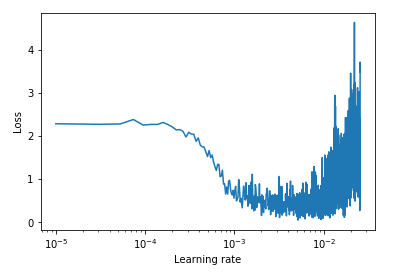
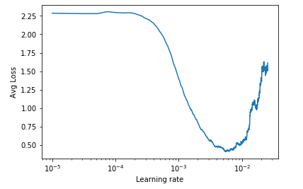
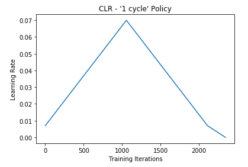
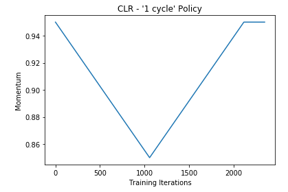
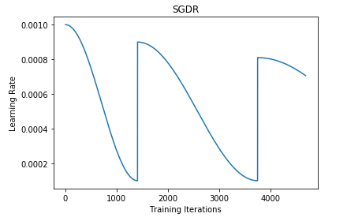
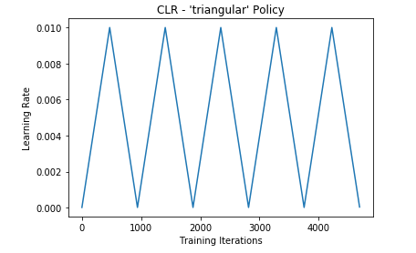

# Learning Rate

Keras Callbacks to :

- Find the optimal Learning Rate
- Use Stochastic Gradient Descent with Restart
- Use Cyclical Learning Rate

## Learning Rate Finder

### Usage 

```
lr_finder = LRFinder(min_lr=1e-5, max_lr=1e-2, step_size=np.ceil(X_train.shape[0]/batch_size))

model.fit(X_train, y_train, callbacks=[lr_finder] )
```


```
# Plot the raw losses (they can be noisy)
lr_finder.plot_loss()
```



```
# Plot the smoothed losses
lr_finder.plot_avg_loss()
```



## 1-cycle policy

```
clr = CLR(min_lr=7e-3, max_lr=7e-2, min_mtm = 0.85, max_mtm = 0.95, annealing=0.1, step_size=np.ceil(((X_train.shape[0]*epochs)/(batch_size*2))))
```




## Stochastic Gradient Descent with Restart

```
sgdr = SGDRS(min_lr=1e-4,max_lr=1e-3,step_size=np.ceil(X_train.shape[0]/batch_size), lr_decay=0.9, mult_factor=1.5)

model.fit(X_train, y_train, epochs=10, batch_size=128, validation_data=(X_test, y_test), callbacks=[schedule])
```



## Cyclical Learning Rate

```
clr_triangular = CyclicLR(mode='triangular', step_size=np.ceil(X_train.shape[0]/batch_size))

model.fit(X_train, y_train, batch_size=128, epochs=10, validation_data=(X_test, y_test), callbacks=[clr_triangular])
```



## References

This code is based on:

- The method described in the 2015 paper "Cyclical Learning Rates for Training Neural Networks" by Leslie N. Smith
- The implementation of the algorithm in fastai library by Jeremy Howard.
- [This](https://github.com/bckenstler/CLR) implementation of CLR
- The blog of Sylvain Gugger : https://sgugger.github.io

